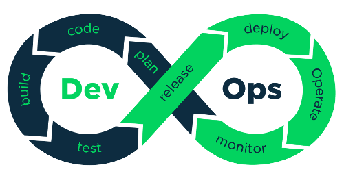

# Intro


DevOps is a software development method that stresses communication, collaboration, integration, automation, and measurement of cooperation between software developers and other information-technology (IT) professionals and operation.

* Continuous integration (CI) is a software engineering practice in which isolated changes are immediately tested and reported on when they are added to a larger code base

* Continuous Delivery (CD) is a software development discipline where software is built in such a way that the software can be released to production at any time.

* Continuous Deployment (CD) is an extension to delivery extending deployment of new SW release into a existing network.


## Devops tools (Follow links to specific tools documentation) 

## Foundamentals

* SQL 
* Networking
* Linux admin 

### Platforms
* [AWS](https://github.com/dirakx1/AWS)
* Openstack
* [GCP](https://github.com/dirakx1/GCP)
* alibaba cloud
* Azure

## CI/CD
* [Jenkins](https://github.com/dirakx1/Jenkins) -Cloudbees
* Gitlab/Github pipelines
* Spinnaker
* Octupus
* TeamCity

### Web servers

* Nginx
* Apache

## Monitoring
* Nagios
* [Zabbix](https://github.com/dirakx1/Zabbix)
* Stackdriver for GCP

### Task/Queue message management
* [Rabbitmq](https://github.com/dirakx1/Rabbitmq)
* Redis
* [Celery](https://github.com/dirakx/Celery)

### Cache management
* memcached
* memorystore (redis manejado en GCP) 

### Orchestration
* Ansible
* Chef
* [Puppet](https://github.com/dirakx/Puppet) - Puppet bolt

### Cloud Orchestration
* [Terraform](https://github.com/dirakx1/Terraform)
* CloudFormation
* Pullumi

## Container Orchestration

* [Kubernetes](https://github.com/dirakx1/kubernates)
* Docker swarm 
* Nomad
* Openshift
* Rancher
* Amazon Elastic Container Service
Amazon Elastic Container Service (ECS) is a hosted service provided by Amazon Web Services (AWS) to run Docker containers at scale on its infrastructure.
* Azure Container Instances
Azure Container Instance (ACI) is a basic container orchestration service provided by Microsoft Azure.
* Azure Service Fabric
Azure Service Fabric is an open source container orchestrator provided by Microsoft Azure.
* Marathon

### Log management

* ELK stack:
```
*Elastic search for indexing and storage of logs
*Kibana for analysis and visualization
*Logstash for data agregation and processing. 
*Beats: data collection 
```
* Splunk
* Stackdriver(https://cloud.google.com/stackdriver/)

## Log statistics / graphics
* Grafana. 
* Kibana
* stackdriver (GCP)

### Containerization

* [Docker](https://github.com/dirakx/Docker)

### Databases
* [Postgres](https://github.com/dirakx/Postgres)
* Mysql
* [MSSQL](https://github.com/dirakx/Mssql)
* [Mongodb](https://github.com/dirakx/Mongodb)(NoSql)
* Influxdb

### Version control
* [Git(Gitlab/Github)](https://github.com/dirakx/Git)

### Microservices devops tools
* https://www.consul.io/ (Multicloud)
* Istio  

### Other tools 

#### Sonarqube (Code quality)

##### Usage 

* Create new project (maven / gradle) 
* Provide mvn / gradle configurations for projects f.e:

```
mvn sonar:sonar \
 -Dsonar.projectKey=test \
 -Dsonar.host.url=http://yyy.yyy.yyy.yyy \
 -Dsonar.login=tokentokentokentookeneene
```
* Jmeter/Gatlin (Performance / load testing)
* Nexus (Artifact repository)

### Devops-SRE definitions

* service level indicators (SLIs), objectives (SLOs), and agreements (SLAs)

### Questions

* https://medium.com/better-programming/top-8-devops-interview-questions-and-answers-9120f554d1b9
